# System Diagrams

The diagrams in this document are intended to make the project understandable before implementation begins. They focus on system boundaries, data flow, sync behavior, and the interaction between the app and system-level domain enforcement.

## 1. System Context

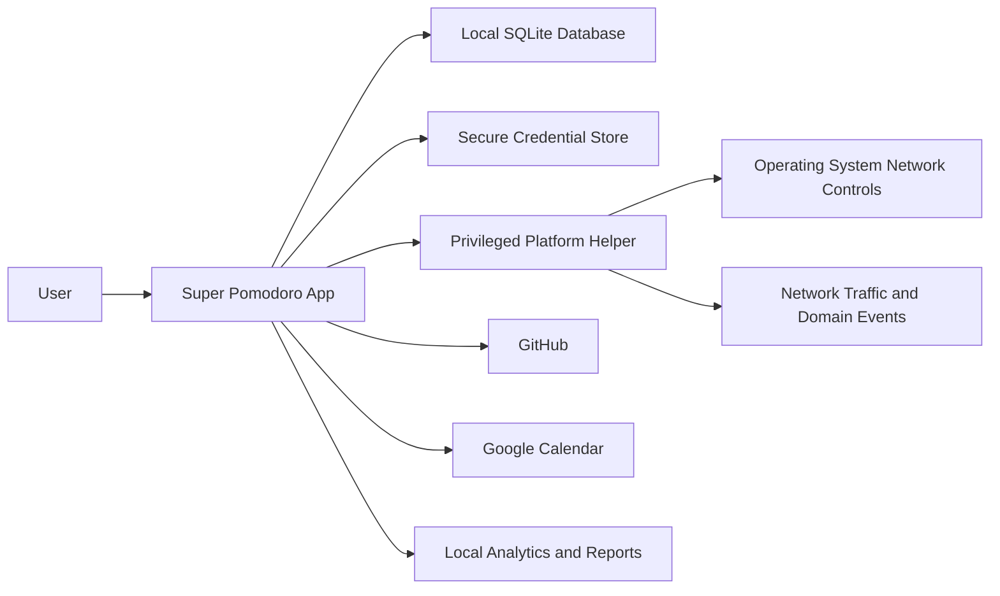

## 2. High-Level Component Architecture

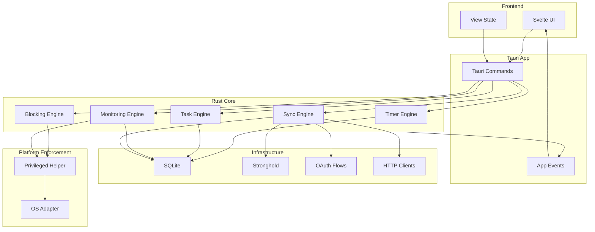

## 3. Repository and Runtime Boundaries

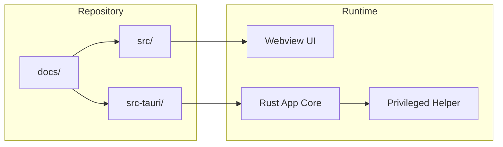

## 4. Domain Model

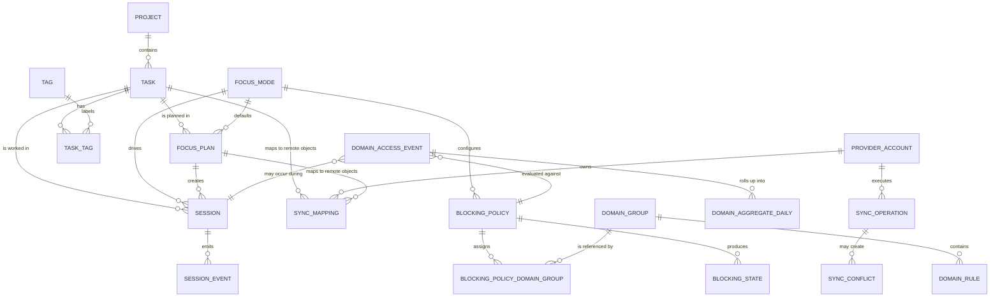

## 5. Focus Session and Blocking Flow

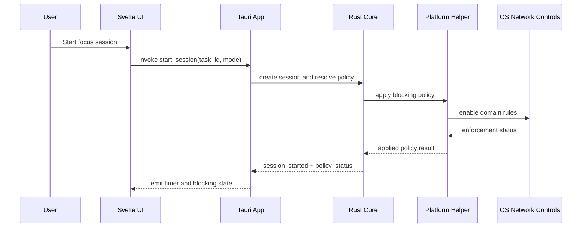

## 6. Session State Machine

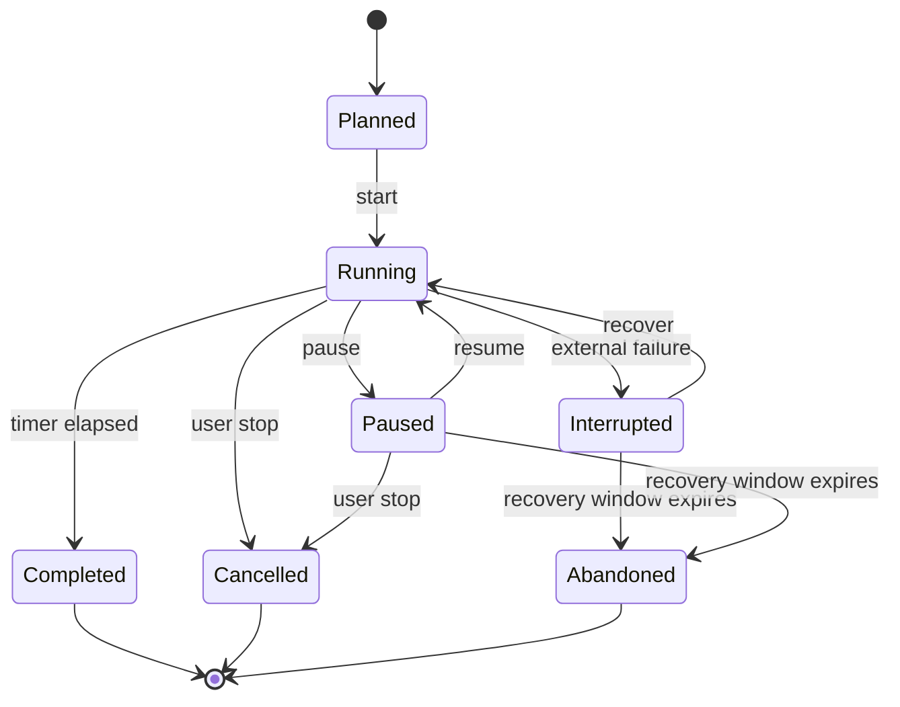

## 7. Domain Monitoring Flow

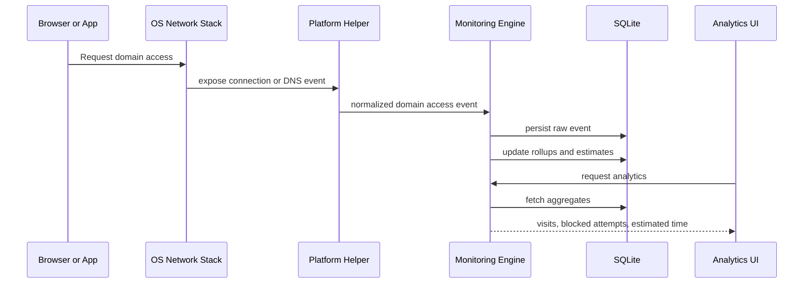

## 8. Sync Flow

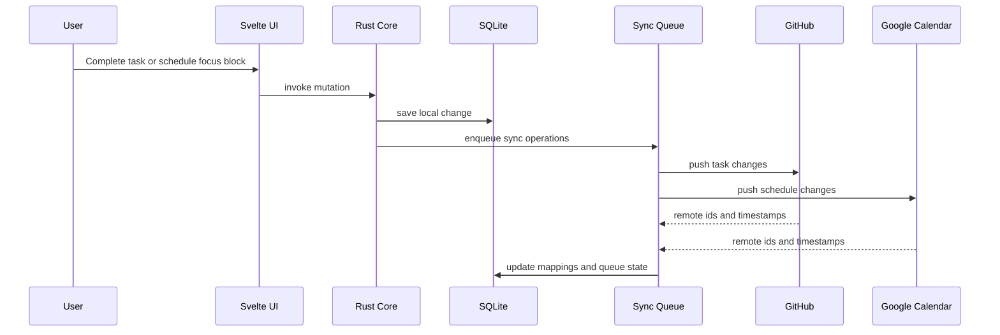

## 9. Time Estimation Pipeline

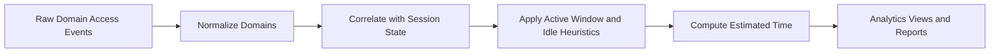

## 10. Helper IPC

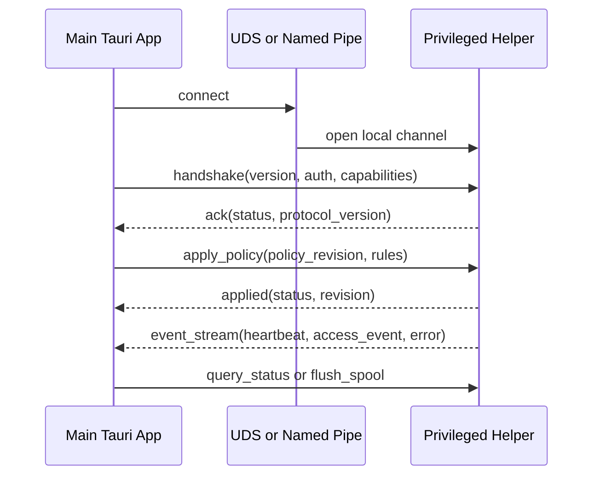

## 11. Deployment Architecture

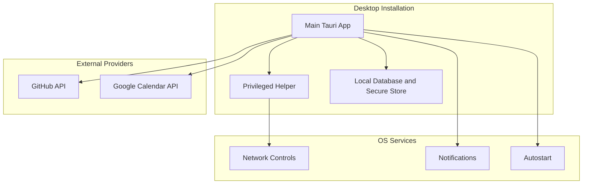

## 12. Responsibility Split

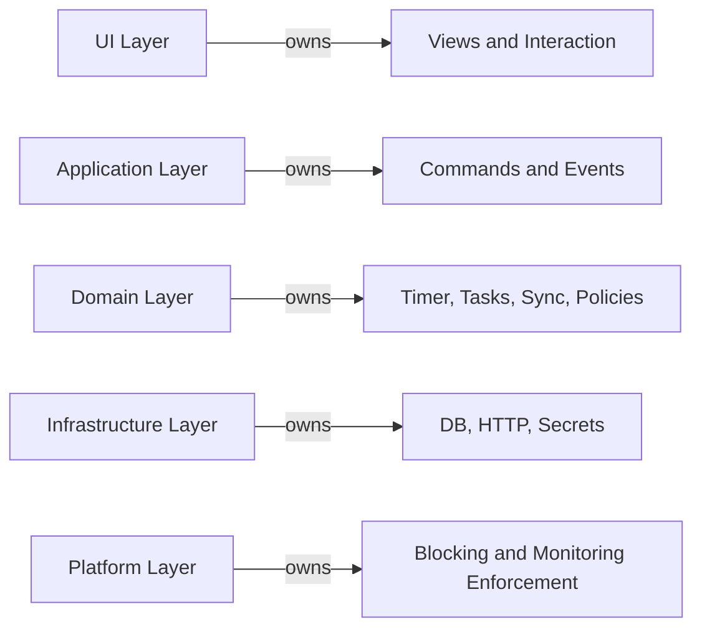
